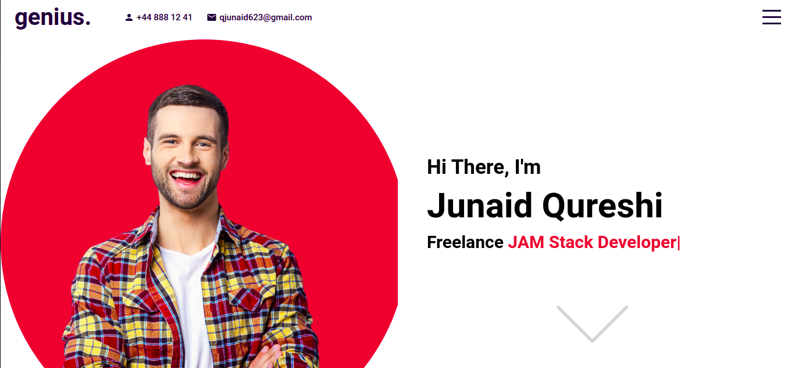

# React Portfolio

# HOMEPAGE

### :link: Learned from : [Lama Dev](https://youtu.be/7WwtzsSHdpI)

## Run Locally

- Run this command `git clone https://github.com/developer-junaid/React-Portfolio.git`
- You are now in the dev environment and you can play around

## Tech Stack

- HTML5
- CSS3
- Scss/Sass
- Javascript ES6
- React js
- Libraries
- - ityped
- - node-sass
